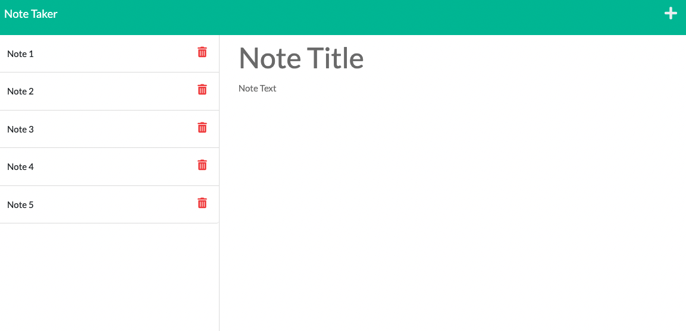

# Note Taker

  
  

  ## Description
  This is a note taking app that can write and save notes using an Express.js back end. This saves and retrieves note data from a JSON file, and the living app is deployed to Heroku.
  
  ## Table of Contents
  - [Installation](#installation)
  - [Usage](#usage)
  - [Contributing](#contributing)
  - [License](#license)
  
  ## Installation
  This requires Node.js in order to run, as well as Express.js and the uuid module.
  
  ## Usage
  The app is [deployed on Heroku](https://peaceful-bastion-70910.herokuapp.com/notes). If you'd like to modify, please create a branch and ensure you have Node.js and run npm install against the dependancies folder to ensure full functionality.
  
  ## License
  Read more about MIT here: [MIT](https://opensource.org/licenses/MIT)

   
  
  ## Contributing
  Contributors should read the installation section.
  
  ## Tests
  None
  
  ## Questions
  - GitHub: [View my profile](https://github.com/ajolsavsky)
  - Email: alexandraolsavsky@gmail.com
  